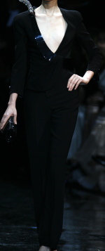
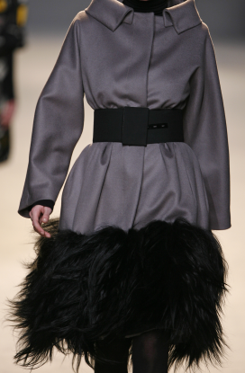
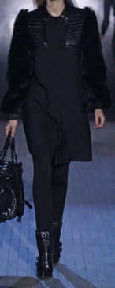

# Fine-Grained Designer Classification in Fashion Imagery

## Overview

This project explores the intersection of **fashion and computer vision**, focusing on how **model complexity influences performance** in **fine-grained visual categorization (FGVC)** tasks. Specifically, we aim to classify runway images by their **designer labels** across 50 unique fashion houses.

Our study benchmarks traditional architectures (e.g., **ResNet-18**) against **lightweight convolutional variants** to analyze trade-offs between:
- Model depth and parameter efficiency  
- Accuracy and generalization  
- Computational cost and interpretability  

Ultimately, we aim to establish **baseline performance** for this dataset and provide insights into how model capacity affects **fine-grained visual understanding** within the fashion domain.

---

## Motivation

Fashion imagery offers a unique balance of **structure and abstraction**—garments, accessories, and textures are visually distinct, yet highly variable. This makes designer-level classification a particularly rich testbed for understanding how CNNs capture **stylistic signatures** such as cut, color, and silhouette.

While datasets like *Fashionpedia* and *DeepFashion* have advanced attribute and segmentation-level understanding, our focus is narrower: exploring **designer recognition** as a constrained classification problem. This work contributes a benchmark and analysis framework for this under-explored task.

---

## Dataset

The dataset originates from the **CVPR 2019 Fine-Grained Visual Categorization (FGVC)** competition. It consists of:

- **50,000 high-resolution runway images**
- **50 designer classes** (e.g., *Gucci*, *Prada*, *Alexander McQueen*, *Valentino*, etc.)
- Each image labeled with the **designer** responsible for the depicted garment


Example images:

| Designer | Example |
|-----------|----------|
| Armani | |
| Valli |  |
| Alexander Wang |  |


---

## Data Structure

After processing, the dataset is stored in the `torch_data/` directory.  
This directory contains all serialized data shards, label mappings, and metadata files required for training and validation.

### Directory Layout


### File Descriptions

| File / Folder | Description |
|----------------|-------------|
| **meta.json** | Summarizes dataset configuration and processing statistics (e.g., image size, class count, shard size, number of valid/failed samples). |
| **label_to_index.json** | Maps each designer (class name) to a unique integer index. |
| **index_to_label.json** | Inverse mapping of class indices back to designer names. |
| **train_files.json**, **val_files.json**, **test_files.json** | Lists the original file paths and class indices for each split — useful for traceability and reproducibility. |
| **train/**, **val/** | Directories containing the actual image shards in serialized `.pt` format for each split. Each shard contains a batch of preprocessed images and labels. |

### Shard File Contents

Each `.pt` file (e.g., `train_0000.pt`) contains a PyTorch dictionary with three tensors:

```python
{
    "images": Tensor[N, 3, H, W], # uint8 RGB images resized to image_size
    "labels": Tensor[N], # int64 class indices (0 to num_classes-1)
    "one_hot": Tensor[N, C] # uint8 one-hot encoded labels
}
```
